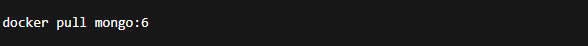
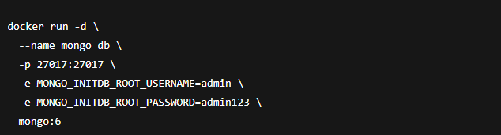
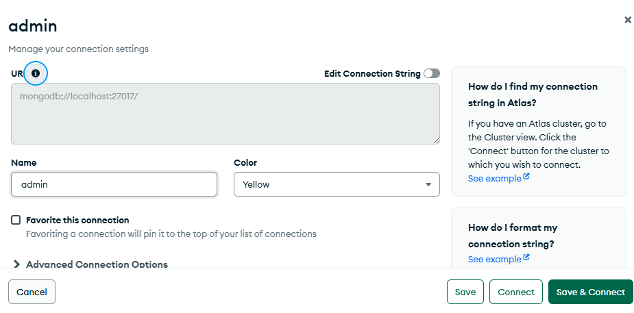
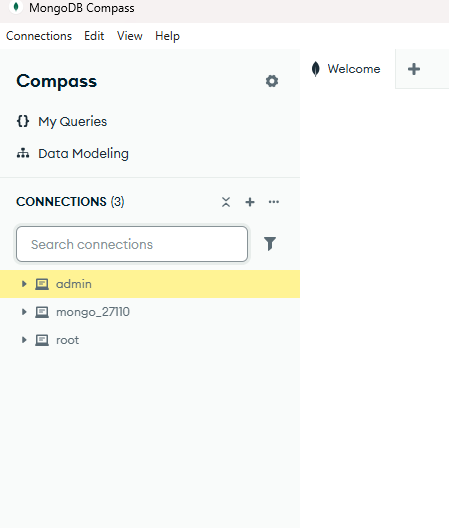

# Crear un contenedor de MongoDB con Docker

1. Descargar la Imagen de MongoDB
El primer paso es descargar la imagen oficial de MongoDB desde Docker Hub:

docker pull mongo:6

mongo:6 indica que descargaremos la versión 6 de MongoDB.
Si no se especifica versión, Docker obtendrá la más reciente.

2. Crear y Ejecutar el Contenedor

Usamos el siguiente comando para crear el contenedor:

docker run -d \
  --name mongo_db \
  -p 27017:27017 \
  -e MONGO_INITDB_ROOT_USERNAME=admin \
  -e MONGO_INITDB_ROOT_PASSWORD=admin123 \
  mongo:6

Explicación de parámetros:
Parámetro	Descripción
docker run -d	Ejecuta el contenedor en segundo plano (modo daemon)
--name mongo_db	Asigna un nombre al contenedor
-p 27017:27017	Publica el puerto 27017 del contenedor al host
-e MONGO_INITDB_ROOT_USERNAME	Define el usuario administrador
-e MONGO_INITDB_ROOT_PASSWORD	Define la contraseña del administrador
mongo:6	Imagen que se usará para crear el contenedor

3. Verificar que el Contenedor Está Activo

Conectarse al Contenedor
Acceder al shell del contenedor
docker exec -it mongo_db bash

Conectarse a MongoDB dentro del contenedor:
mongosh -u admin -p admin123

me conecto desde mi manejador a el contenedor de mongo db 

# Punto  Ubuntu en Docker para Motores de Base de Datos

En este paso creamos un entorno basado en Ubuntu dentro de Docker, el cual será utilizado como estación de administración para conectarnos a los cuatro motores de bases de datos: MySQL, PostgreSQL, MongoDB y SQL Server.

Creación del Dockerfile

Primero se crea una carpeta de trabajo y dentro de ella se genera un archivo llamado Dockerfile. Este archivo define la imagen personalizada de Ubuntu que usaremos.

# Imagen base Ubuntu
FROM ubuntu:22.04

# Actualizamos paquetes e instalamos herramientas básicas del sistema

RUN apt-get update && apt-get install -y \
    wget curl apt-transport-https ca-certificates gnupg lsb-release \
    software-properties-common nano sudo

# Instalamos los clientes de MySQL, PostgreSQL y MongoDB

RUN apt-get install -y mysql-client postgresql-client mongodb-clients

# Instalamos herramientas de SQL Server (sqlcmd y bcp)

RUN curl -s https://packages.microsoft.com/keys/microsoft.asc | apt-key add - && \
    curl https://packages.microsoft.com/config/ubuntu/22.04/prod.list > /etc/apt/sources.list.d/mssql-release.list && \
    apt-get update && ACCEPT_EULA=Y apt-get install -y mssql-tools18 unixodbc-dev && \
    echo 'export PATH="$PATH:/opt/mssql-tools18/bin"' >> ~/.bashrc

Explicación:

Se instala Ubuntu y las herramientas necesarias para conectarse a múltiples motores de base de datos.

Se agregan clientes SQL y herramientas administrativas (sqlcmd, psql, mongo, mysql).

No se está instalando el servidor de BD en Ubuntu; solo los clientes para administración.

Creación del archivo docker-compose.yml

En la misma carpeta creamos un archivo docker-compose.yml. Este archivo de creación y ejecución de:

Ubuntu,MySQL,PostgreSQL,SQL Server y MongoDB

version: "3.9"
services:
  ubuntu_env:
    build: .
    container_name: ubuntu_multi_db
    tty: true
    stdin_open: true
    networks:
      - db_network
    depends_on:
      - mysql
      - postgres
      - mssql
      - mongodb
    volumes:
      - ./data:/data
    ports:
      - "2222:22"   # opcional si deseas acceso SSH al contenedor

  mysql:
    image: mysql:8.0
    container_name: mysql_db
    restart: always
    environment:
      MYSQL_ROOT_PASSWORD: root123
      MYSQL_DATABASE: testdb
    ports:
      - "3306:3306"
    networks:
      - db_network
    volumes:
      - mysql_data:/var/lib/mysql

  postgres:
    image: postgres:15
    container_name: postgres_db
    restart: always
    environment:
      POSTGRES_USER: postgres
      POSTGRES_PASSWORD: root123
      POSTGRES_DB: testdb
    ports:
      - "5432:5432"
    networks:
      - db_network
    volumes:
      - postgres_data:/var/lib/postgresql/data

  mssql:
    image: mcr.microsoft.com/mssql/server:2022-latest
    container_name: mssql_db
    restart: always
    environment:
      ACCEPT_EULA: "Y"
      SA_PASSWORD: "Root123!"
    ports:
      - "1433:1433"
    networks:
      - db_network
    volumes:
      - mssql_data:/var/opt/mssql

  mongodb:
    image: mongo:7
    container_name: mongodb_db
    restart: always
    ports:
      - "27017:27017"
    networks:
      - db_network
    volumes:
      - mongodb_data:/data/db

networks:
  db_network:
    driver: bridge

volumes:
  mysql_data:
  postgres_data:
  mssql_data:
  mongodb_data:

 Explicación
Este archivo crea la infraestructura completa.
Cada motor de base de datos es independiente, corre en aislamiento, y se conecta en la misma red Docker (db_network).

Construcción y Ejecución

Abrimos la terminal en la carpeta donde están los archivos y ejecutamos:

Construir la imagen personalizada
docker-compose build

Levantar todos los contenedores
docker-compose up -d

Verificar que todo esté corriendo
docker ps

#  Ubuntu con Docker Interno

En este apartado se procede a la creación de un contenedor Ubuntu que actuará como un entorno independiente capaz de ejecutar su propio motor de Docker en su interior. Esta técnica, conocida como Docker-in-Docker (DinD), permite que dentro de un contenedor podamos administrar otros contenedores, lo que simula una máquina virtual ligera.

Este laboratorio es útil para ambientes de formación y pruebas, ya que facilita aprender conceptos como ejecución de servicios Docker, redes internas, gestión de puertos y despliegue de múltiples motores de base de datos desde una sola estación Linux.

El objetivo principal es contar con un contenedor Ubuntu desde el cual se ejecutarán contenedores adicionales correspondientes a los diferentes sistemas gestores de bases de datos (MySQL, PostgreSQL, MongoDB y SQL Server). Cada servicio será accesible desde el exterior mediante puertos específicos ya definidos.

1. Crear el contenedor Ubuntu con privilegios necesarios

Se crea un contenedor Ubuntu con permisos elevados (--privileged) para permitir que Docker corra dentro del contenedor. También se exponen los puertos correspondientes a cada motor de base de datos:

docker run -itd --privileged `
  -p 3316:3316 -p 5445:5445 -p 27110:27110 -p 1438:1438 `
  --name ubuntu_docker ubuntu:22.04

 2. Verificar que el contenedor está activo
docker ps --format "{{.Names}}\t{{.Ports}}"

 3. Acceder a la consola del contenedor
docker exec -it ubuntu_docker bash

Dentro de este entorno Ubuntu trabajaremos como si fuera un sistema real.

4. Instalar Docker dentro del contenedor Ubuntu

Se instalan los paquetes necesarios y se configura el repositorio oficial de Docker:

apt update
apt install -y ca-certificates curl gnupg lsb-release apt-transport-https

mkdir -p /etc/apt/keyrings
curl -fsSL https://download.docker.com/linux/ubuntu/gpg \
  | gpg --dearmor -o /etc/apt/keyrings/docker.gpg

echo "deb [arch=$(dpkg --print-architecture) signed-by=/etc/apt/keyrings/docker.gpg] \
https://download.docker.com/linux/ubuntu $(lsb_release -cs) stable" \
> /etc/apt/sources.list.d/docker.list

apt update
apt install -y docker-ce docker-ce-cli containerd.io
5. Iniciar Docker dentro del contenedor
dockerd >/var/log/dockerd.log 2>&1 & disown
sleep 4
docker version

Ahora el contenedor Ubuntu ya cuenta con su propia instancia Docker operativa.

6. Crear la red para las bases de datos
docker network create redes_bd 2>/dev/null || true

Esta red interna facilitará la comunicación entre los servicios.

7. Desplegar los motores de base de datos dentro del Ubuntu
 MySQL
docker run -d --name mysql_db \
  --network redes_bd \
  -p 3316:3306 \
  -e MYSQL_ROOT_PASSWORD=RootPass123! \
  -e MYSQL_DATABASE=mi_basedatos \
  -e MYSQL_USER=usuario_mysql \
  -e MYSQL_PASSWORD=PassMysql123! \
  -v mysql_data:/var/lib/mysql \
  --restart unless-stopped \
  mysql:8.0

 PostgreSQL
docker run -d --name postgres_db \
  --network redes_bd \
  -p 5445:5432 \
  -e POSTGRES_USER=usuario_pg \
  -e POSTGRES_PASSWORD=PassPG123! \
  -e POSTGRES_DB=mi_basedatos_pg \
  -v pg_data:/var/lib/postgresql/data \
  --restart unless-stopped \
  postgres:15

 MongoDB
docker run -d --name mongo_db \
  --network redes_bd \
  -p 27110:27017 \
  -e MONGO_INITDB_ROOT_USERNAME=usuario_mongo \
  -e MONGO_INITDB_ROOT_PASSWORD=PassMongo123! \
  -v mongo_data:/data/db \
  --restart unless-stopped \
  mongo:6

 SQL Server
docker run -d --name mssql_db \
  --network redes_bd \
  -p 1438:1433 \
  -e ACCEPT_EULA=Y \
  -e SA_PASSWORD=MiPassw0rdSQL! \
  -v mssql_data:/var/opt/mssql \
  --restart unless-stopped \
  mcr.microsoft.com/mssql/server:2019-latest

8. Validación final

Se listan los contenedores para confirmar su ejecución:

docker ps --format "table {{.Names}}\t{{.Image}}\t{{.Ports}}"

Si todo está correcto, debe visualizarse el contenedor Ubuntu y los cuatro motores de base de datos ejecutándose dentro de él.

Con este procedimiento se configuró un entorno Ubuntu capaz de administrar Docker y levantar múltiples servicios de bases de datos desde su interior. Este enfoque facilita:

Simulación de entornos profesionales para bases de datos

